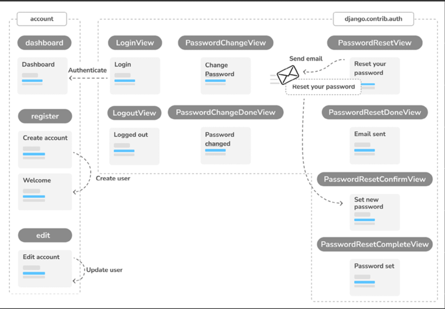
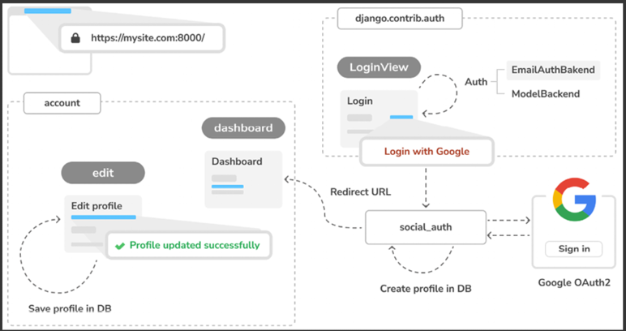
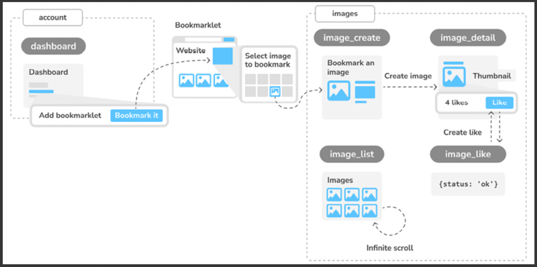
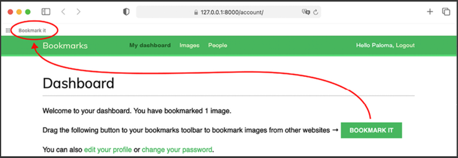
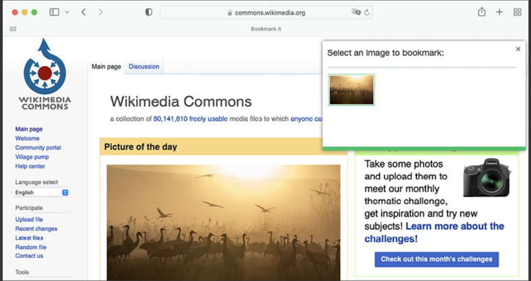
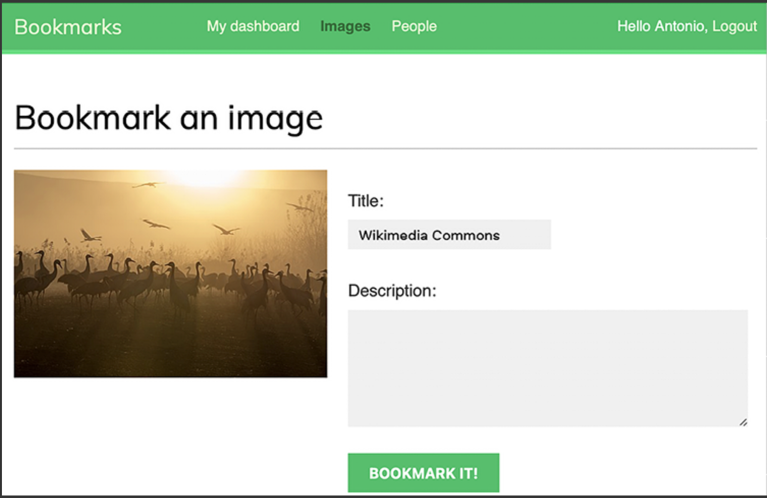

# Social Network Application

A minimal Django project you can use as a starter: clean settings, sane defaults, and the usual dev tasks (run server, migrations, tests).

Steps:

* [x] Creating a login view
* [x] Using the Django authentication framework
* [x] Creating templates for Django login, logout, password change, and password reset views
* [x] Creating user registration views
* [x] Extending the user model with a custom profile model
* [x] Configuring the project for media file uploads


* [x] Using the messages framework
* [x] Building a custom authentication backend
* [x] Preventing users from using an existing email
* [x] Adding social authentication with Python Social Auth
* [x] Running the development server through HTTPS using Django Extensions
* [x] Adding authentication using Google
* [x] Creating a profile for users that register with social authentication


* [x] Creating many-to-many relationships
* [x] Customizing behavior for forms
* [x] Using JavaScript with Django
* [x] Building a JavaScript bookmarklet
* [x] Generating image thumbnails using easy-thumbnails
* [x] Implementing asynchronous HTTP requests with JavaScript and Django
* [x] Building infinite scroll pagination

## Requirements
- Python 3.11+ (3.12 recommended)
- pip or uv / pipenv / poetry (pick your favorite)
- Git

---

## Quick Start

```bash
# 1) Virtual env
python -m venv .venv
source .venv/bin/activate  # Windows: .venv\Scripts\activate

# 2) Install deps
pip install -U pip wheel
pip install -r requirements.txt  # or `pip install -e .` if using a pyproject

# 3) Environment variables
cp .env.example .env

# 4) DB + superuser
docker pull postgres:latest

docker run --name=social_db \
  -e POSTGRES_DB=social \
  -e POSTGRES_USER=social \
  -e POSTGRES_PASSWORD=xxxxx \
  -p 5432:5432 \
  -d postgres
  
cd mysite
python manage.py migrate
python manage.py createsuperuser

# 5) Run
python manage.py runserver
```







## Bookmarlet Usage 

add bookmarklet script (button's javascript url) into bookmarks of browser


Open a new URL with your browser, for example, https://commons.wikimedia.org/.

Click on the Bookmark it bookmarklet to display the image selection overlay. You will see the image selection overlay like this:


If you click on an image, you will be redirected to the image creation page, passing the title of the website and the URL of the selected image as GET parameters. The page will look as follows:
